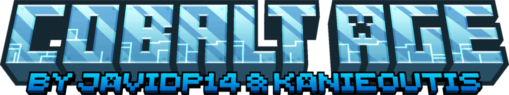
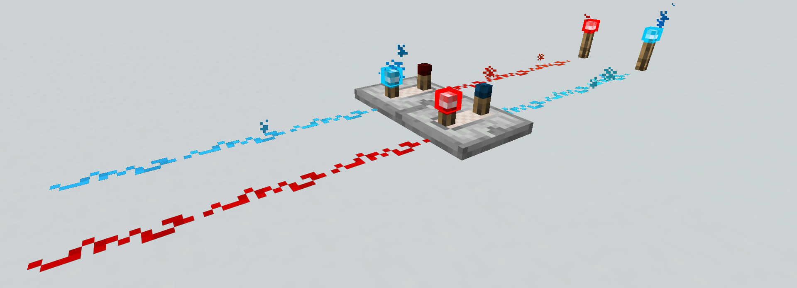

# About

This mod adds a new mineral to the game, the cobalt, which can be found in the overworld. The main feature of this mineral is to work on a similar way to redstone, being different on the aspect that it can be waterlogged and the fact that it is completely independent of redstone, making it possible to have parallel lines without them interfering each-other.

  
<b>Spoiler</b>

It also comes with a new set of redstone components, similar to their redstone counterpart, that react with cobalt, a converter, which works as a bridge between cobalt and redstone, and a new type of rail: the cobalt rail.

  
<b>Spoiler</b>

### Cobalt Rail
This new rail works on a similar way to the powered rail, with the main difference between them being the speed of the cobalt rail, which is of 24BPS, as it is meant for long distance travels.

**IMPORTANT!**
To make the cobalt rail reach the speed of 24BPS, it is necessary to activate the experimental minecart improvements.

There is also a new custom gamerule added that lets modify both the speed of both type of rails (powered and cobalt one).
Which is this one: `gamerule cobaltAgeRailSpeed <value>`, being the value the speed in BPS (blocks per second). Keep in mind that is also necessary to modify the gamerule `max_minecart_speed`. 

Although the speed of both type of rails can be modified, we recommend that at least one of the rails keeps the vanilla speed (8BPS).

### Converter
The converter is a block that works as a bridge between redstone and cobalt, letting players transform the energy source from one type to the other. This also helps as ensure there is a way to connect cobalt to modded redstone machinery.

  
<b>Spoiler</b>

---
# Resource packs

We have included two optional resource packs on this mod. One makes the cobalt rails have a 3D appereance. The other one lets the player see the power level the cobalt dust is emitting on a similar way to how the VanillaTweaks resource pack does.

  
<b>Spoiler</b>

---

You can use this mod freely in your modpacks, but please give credit to the original author and link back to this page. If you want to make a video about this mod, please also give credit and link back to this page.

If you want to suggest a feature or report a bug, please open an issue on the GitHub repository.

