# About

This mod adds a new mineral to the game, the cobalt, which can be found in the overworld. The main feature of this mineral is to have, when merging a cobalt nugget with redstone, the cobalt dust. This dust works **the same way as redstone**, being **different on the aspect that it can be waterlogged and that it is an independent energy system from redstone**, making it possible to have parallel lines without them interfering each-other. Unlocking possibilities such as waterlogged item sorter, underwater circuits and hidden doors, and surface circuits that cannot be broken when an annoying water flow comes: this is valid for every cobalt-energy block: Cobalt Repeater / Cobalt Comparator / Cobalt wire / Converter / Relay.
Plus, cobalt wires uses a modern system to optimize power computations and math, resulting up to 1000 times lagless than redstone, making this redstone type energy even more useful than redstone when making huge circuits.
**This modern system to compute the power and the energy flow reflects perfectly the vanilla order of computations, in order to preserve vanilla bugs/features such as dupe machines**: this means this mod **resolves the lag of huge redstone circuits if you use Cobalt Energy Blocks (CEBs) instead of the redstone ones (REBs), preserving the vanilla orders for computations**.

This mod also adds new looks for your armors. It adds Cobalt Ingot and Cobalt Dust items to be used as material template in the smithing table. A new armor trim shape has been added: Dust Armor Trim.

  
<b>Performance Tests</b>

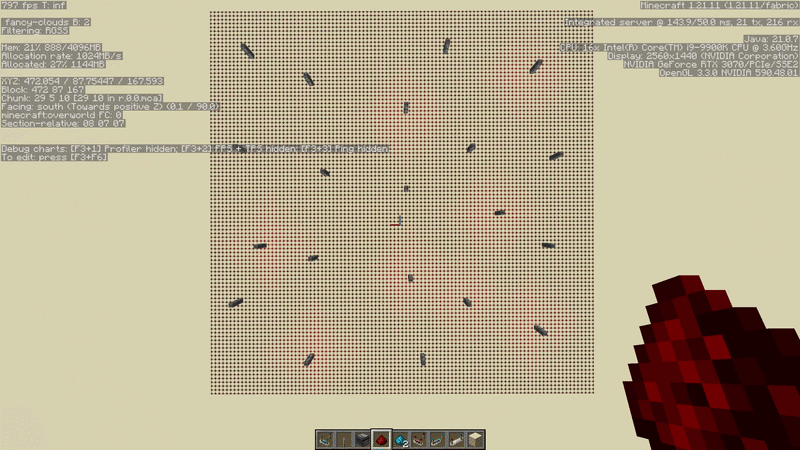

- Scatter Test in a 100 x 100 wire linked web with 20 observer clocks. Cobalt dust does not cause not even a minimum server lag or client FPS drops (10 ms over 50 ms), while redstone dust cause a huge lag and a huge delay of 2.8 seconds from a tick to another one (130+ ms over 50ms). You can see the delay in the redstone update signals in the shown videos.

  
<b>Spoiler: Prallel Wires</b>

  
<b>Spoiler: Cobalt Age Showcase</b>

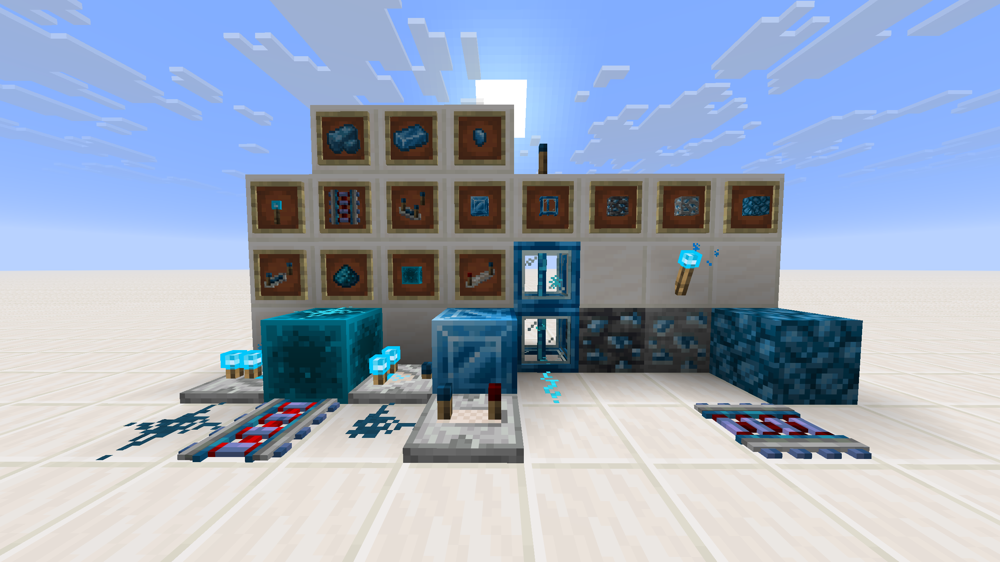

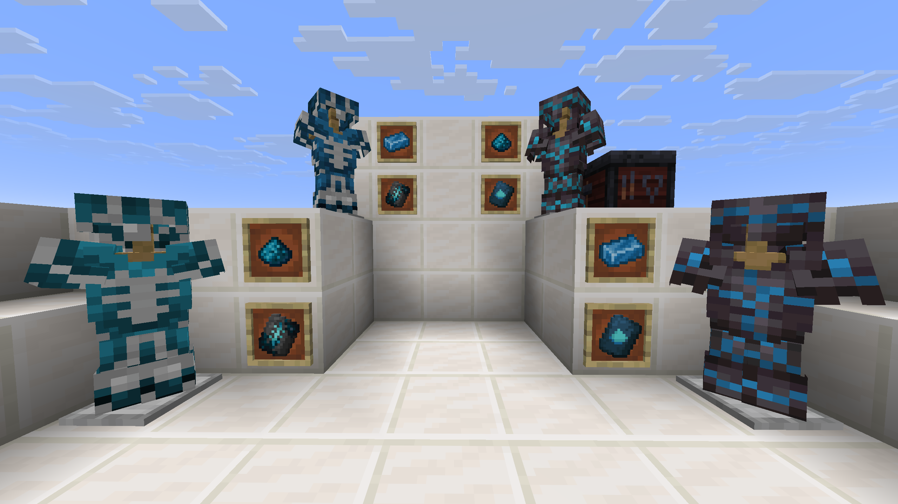

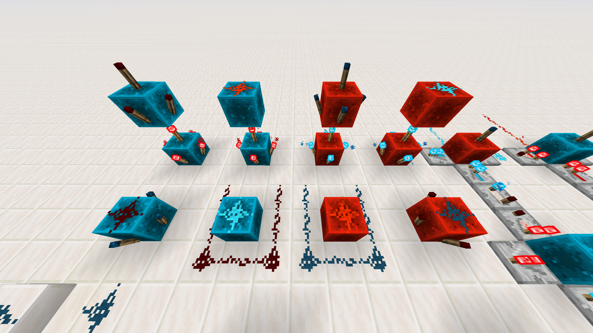

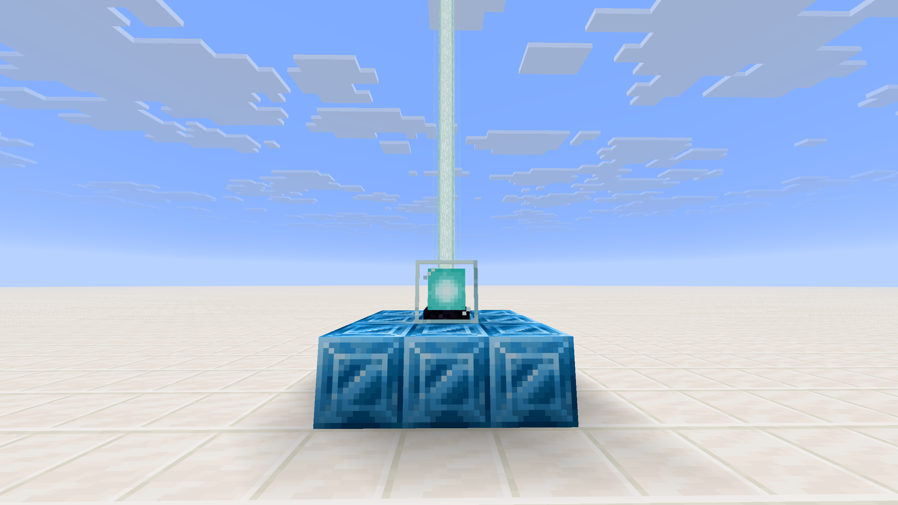

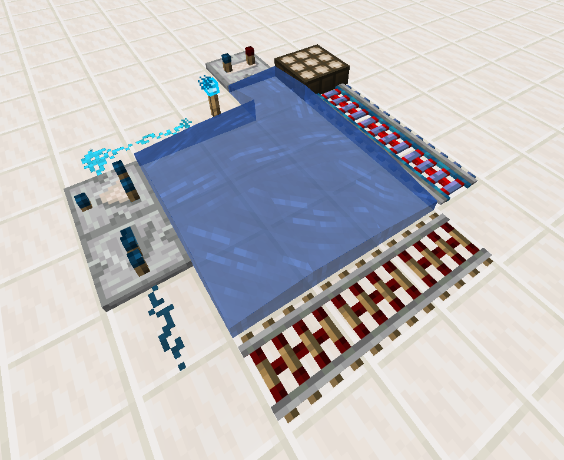

As anticipated, Cobalt Age adds a new complete set of redstone components, similar and indipendent to their redstone counterpart, that reacts only and only with Cobalt Energy Blocks (CEBs). Exception has been made for Cobalt Comparator, which of couse can read the energy from Chests, Hoppers, Item Frames and more... But cannot read energy from Redstone Energy Blocks (REBs). The same way, the Redstone Comparator cannot read energy from a Cobalt Energy Block (CEB) - see **Further Examples** down below. Another exception has been made for Dust Blocks: CEBs can cobalt power a Redstone Dust Block. The same way, Cobalt Dust Block can be redstone powered by a REB. See the spoiler for further clarifications.
All energy emitter blocks like Lever, Button, Pressure Plates, Lectern, Sculk Sensors are able to power CEBs.

    
<b>Spoiler: Further Examples</b>

Showcase of CEBs and REBs independent behavior when mixed. 
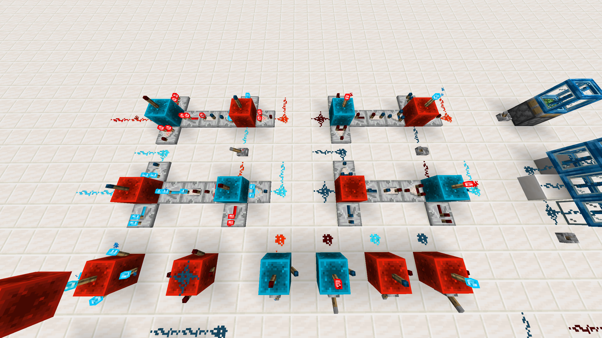

Showcase of the Glass Diode for Cobalt Wires. The logic has been inherited by Redstone Wires.
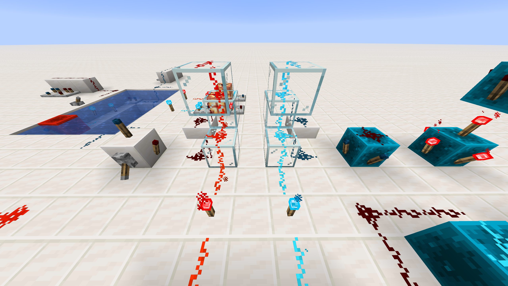

ON / OFF Showncase images for mixed blocks underwater and surface.
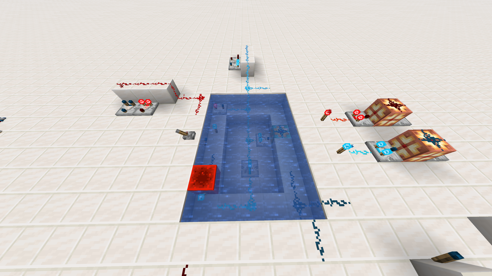

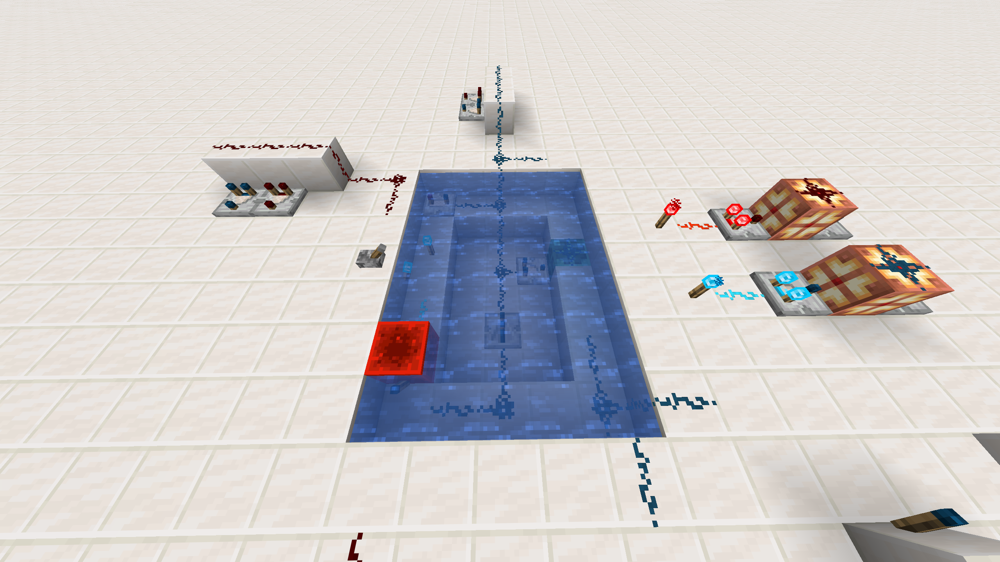

Example of the new armor trim and the new beacon GUI.

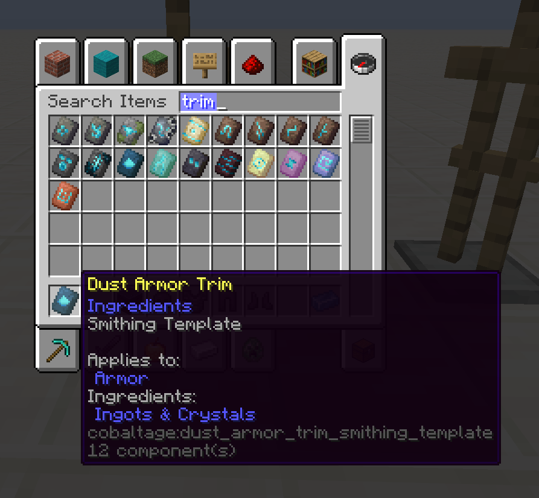

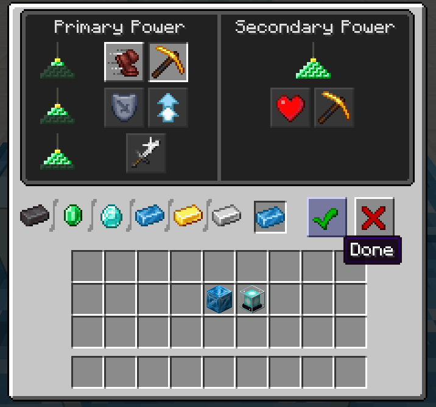

### Cobalt Rail
This new rail works the same way as the powered rail, with the main difference between them being the speed of the cobalt rail, which is of 24BPS by default (but you can change it as you want), as it is meant for long distance travels.

**IMPORTANT!**
To make the cobalt rail reach the speed of 24BPS (or any custom speed), it is necessary to activate the experimental minecart improvements in your world / server.

The custom gamerule that has been added lets you modify the speed of both cobalt and powered rails:
`gamerule cobaltAgeRailSpeed <value>`, where 'value' is the speed in BPS (blocks per second).
Keep in mind that you want to set `max_minecart_speed` as the maximum possible - either you put a large unreal amount or you set that as Max(CobaltRailSpeed, PoweredRailSpeed). 

Despite the speed of both type of rails can be modified, we recommend that at least one of the rails keeps the vanilla minecart speed (8 BPS).

### Converter
The converter which works as a bridge between cobalt and redstone. It is a block that lets players transform the energy source from one type to the other. This also helps as ensure there is a way to connect cobalt to modded redstone machinery if you find any issue with cobalt.
However, by default **all redstone consumer blocks can be powered by cobalt even if they are modded blocks**. A consumer is a block that can recive redstone power, for instance: piston, copper bulb, redstone lamp. While for modded emitters it is not guaranteed that they can power cobalt emergy blocks. As for properties, the converter has 0 ticks delay and powers the block which is facing to (like a repeater does, without its delay feature).

  
<b>Spoiler</b>

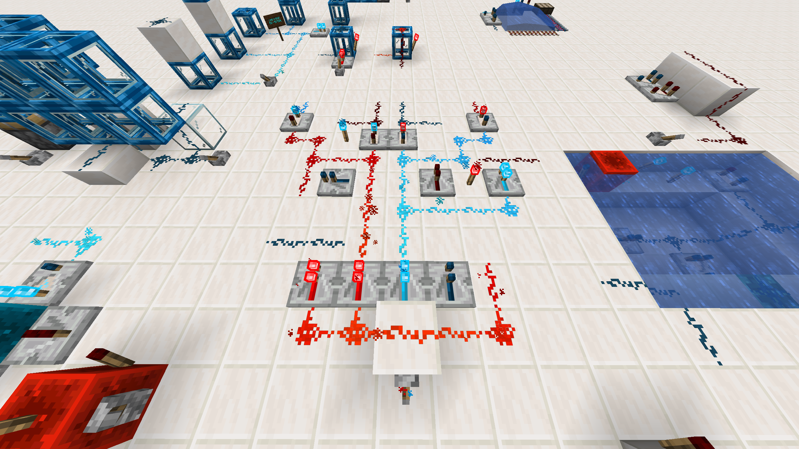

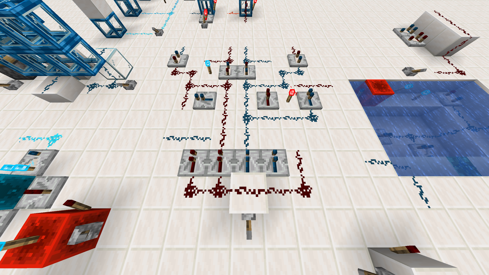

### Relay

The relay is a block that can be used to do vertical signal transmission. It works as a dust, but only powers upwards and downwards, and it can be linked to cobalt dust only horizontally. As a CEB, it only powers other cobalt energy blocks (CEBs) or Consumers (Piston, Dropper...). This block is useful for parallel vertical transmissions. As for other properties, it is a glassy block. That means you can use the classical glass diode logic to make it work as a diode when using redstone wires (see Spoiler)

  
<b>Spoiler</b>

ON / OFF Showcase for the Relay.
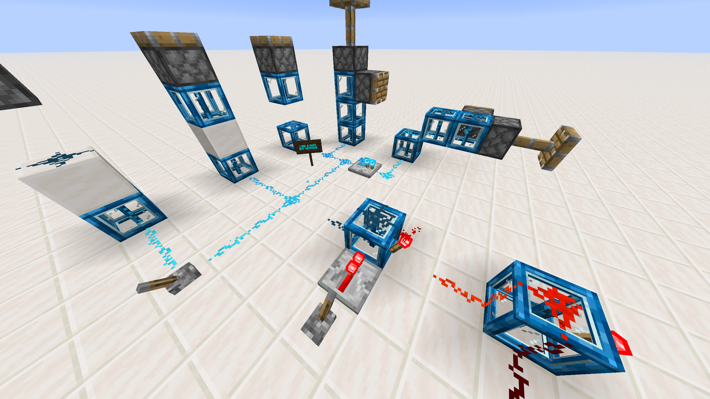

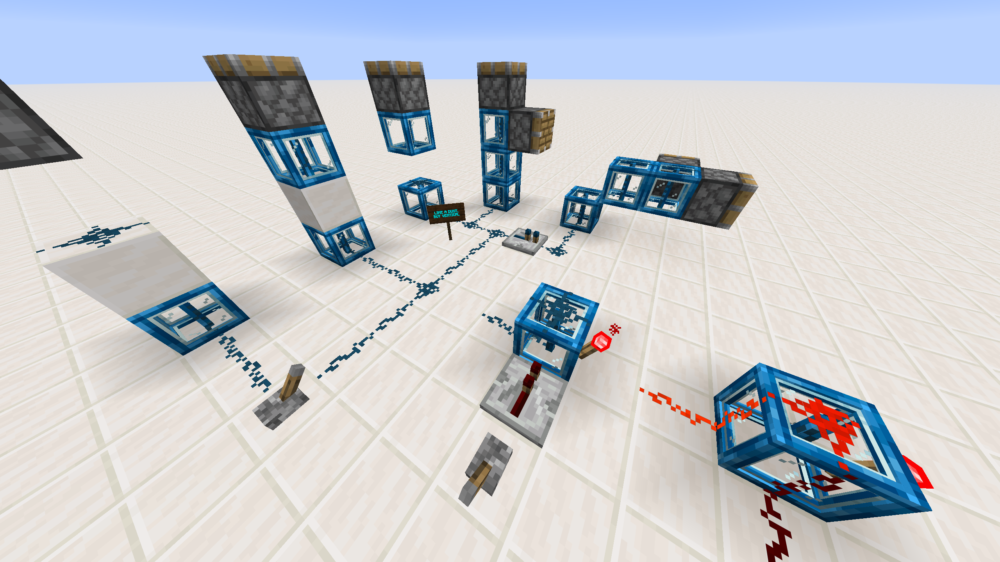

---
# Resource packs

We have included 3 optional resource packs on this mod. One makes the cobalt rails have a 3D appearance. The second one lets the player see the power level the cobalt dust is emitting on a similar way to how the VanillaTweaks resource pack does. The last one puts the Beacon GUI in dark mode (Like Default Dark Mode does).

  
<b>Spoiler</b>

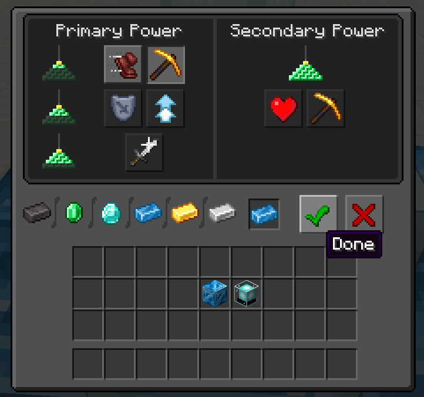

---

# From Authors

You can use this mod freely in your modpacks, but please give credit to the original authors and link back to this page. If you want to make a video about this mod, please also give credit and link back to this page. It is not allowed to take the code, either in whole or by parts, regardless of its extension, without permission for both Creators.

If you want to suggest a feature or report a bug, please open an issue on the GitHub repository.

  

